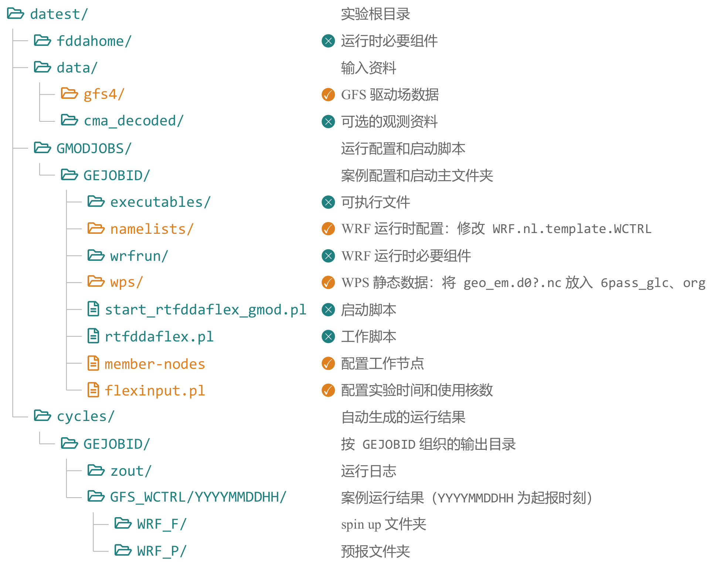

# WRF

## 文件结构



## 运行前准备

### 驱动数据

将`GFS`数据软链接到`data/gfs4`。
进入`/datest/data/`目录下，执行如下命令可看到GFS的数据分布
```bash
Path
```

```{dropdown} 服务器数据分布
:open: 
:icon: code
:color: info
:animate: fade-in
- 历史数据：`/data1/premdev/datainput_arc/gfs4/`
- 实时数据：`/public/home/premdev/data/datainput/gfs4/`
```

链接历史数据：先查看历史数据包括哪些年月，如有所需的，再`ll`查看所需年月包含的日期。

数据以压缩包`.tar`或`.tar.gz`格式出现。

解压`.tar`格式（假设所需年月为2025年8月）：
```bash
tar -xvf 202508.tar
```

解压`.tar.gz`格式：
```bash
tar -xvzf 202508.tar.gz
```

链接实时数据：用`ll`查看实时数据目录下包含的年月日的文件，以`2026082900_fh.0081_tl.press_gr.0p5deg.grib2`形式结尾。

执行如下命令将其链接到目标目录下：
```bash
ln -s 2026082900* /data3/XuRan/datest/data/gfs4/
```

### 静态数据

将生成的`geo_em.d0?.nc`复制到`wps`：
```bash
cp $WPS/geo_em.d0?.nc wps/6pass_glc
cp $WPS/geo_em.d0?.nc wps/org
```

### 配置文件

根据`namelist.wps`修改`GMODJOBS/$GMODJOBS/namelists/WRF.nl.template.WCTRL`：
|参数名称|实际含义|
|:--:|:--:|
|`e_we`/`e_sn`|每个域东西向/南北向的网格数|
|`dx`/`dy`|最外层网格东西向/南北向网格距（单位：米）|
|`i_parent_start`/`j_parent_start`|嵌套域左下角在父域中的`(i,j)`坐标，最外层网格为`1`|
|`parent_grid_ratio`|父域相对于嵌套域相的网格距比值，推荐`3`或`5`，最外层网格为`1`|
>[!TIP]
>该文件下包括`time_control`、`domains`、`physics`（参数化方案）、`fdda`、`dynamics`等


## 运行流程


用`nps`检查各个节点使用情况，
根据实际需要的`node`编号修改`GMODJOBS/$GMODJOBS/member-nodes`。

根据案例时间修改`GMODJOBS/$GMODJOBS/flexinput.pl`：
|参数名称|实际含义|
|:--:|:--:|
|`NUM_DOMS`|嵌套域数量|
|`CYC_INT`|spin up时长|
|`FCST_LENGTH`|预报时长|
|`NUM_PROCS`|总核数|
|`CPUPERNODE`|单个节点的核数|
|`NPROCX`/`NPROCY`|不同方向上分配的核数|

> [!TIP]
> 当前只支持一个节点，所以在设置的时候需要满足`NUM_PROCS = CPUPERNODE = NPROCX * NPROCY`。

> [!NOTE]
> `node13`、`node14`各有32个核
> 
> `node15`、`node16`各有36个核

### 提交任务

在`GMODJOBS/$GMODJOBS`目录下提交任务：
```bash
./start_rtfddaflex_gmod.pl $GMODJOBS $YYYYMMDDHH
```
其中`$GMODJOBS`是实验名称，`$YYYYMMDDHH`是spin up结束时间。
生成的结果在`cycles/$GMODJOBS/GFS_WCTRL/$TIME/`目录下

### 如何查看进程

任意目录下，
```bash
top -u XuRan
```
如果看到 ./wrf.mpich,说明 WRF 主程序已经启动，退出`q`（英文状态下）。

再进入`datest/cycles/$GMODJOBS/GFS_WCTRL`目录下，
```bash
tail -f restrts/rsl.error.0000
```
即可查看运行到哪个时间。退出`ctrl+C`
